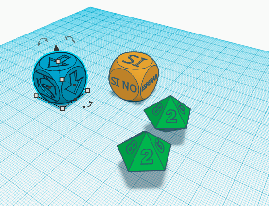
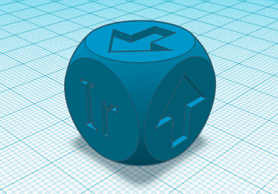
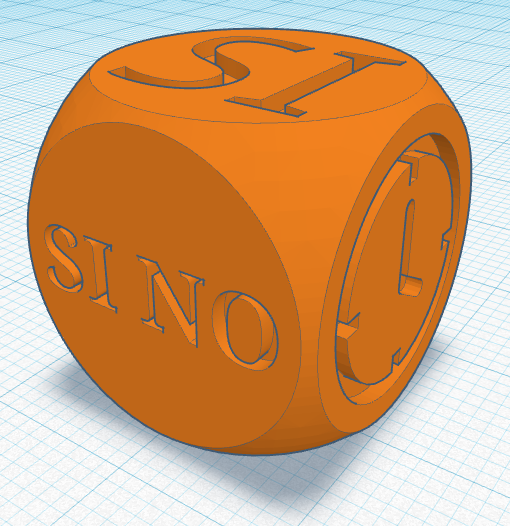
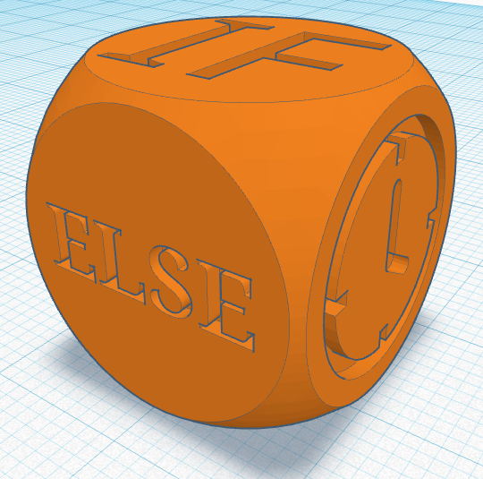
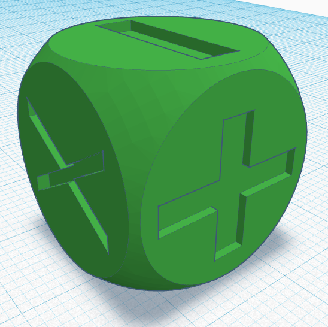
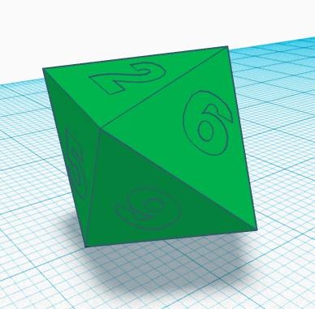
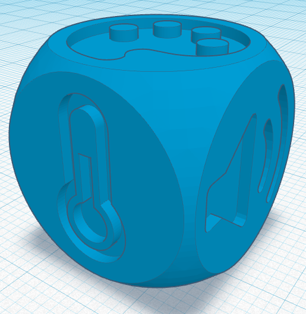

# CoDices

Dados para introducir el pensamiento computacional en edades tempranas. Pueden usarse para trabajar los principios de los algoritmos y introducción al pseudo-código o combinarlos con robot como Escornabot para que los chic@s planifiquen los movimientos que va a hacer el robot antes de ejecutarlos.

Seguiremos la lógica de colores que usan programas como Scratch para que les resulten familiar las acciones que pueden realizar con cada dado: Azul para el movimiento, naranja para el control y condicionales, verde para lógica y matemáticas y azul claro para los sensores. Podéis cambiar los colores de los dados si queréis pero si es recomendable que todos los del mismo tipo sean del mismo color para que los alumnos los encuentren más fácilmente.

Puedes ver el modelo 3D de cada uno de los dados entrando en el enlace de Thingiverse [AQUÍ](https://www.thingiverse.com/thing:2980268)

Todos los dados y complementos están diseñados en Tinkercad para que los alumnos puedan ver de forma fácil cómo están construidos y puedan modificarlos creando sus propios dados personalizados.

[Enlace a Tinkercad](https://www.tinkercad.com/things/iE5ETT8xtZK-codices)

Escornabot es un proyecto robot libre que puedes construir tu mismo e imprimir sus piezas en 3D. Puedes encontrar más información en su [web](http://www.escornabot.com)

## Índice
+ Conoce los CoDices
  - Dado de Movimiento
  - Dado de Control
  - Dado de Matemáticas
  - Dado de Lógica
  - Dado de Números
  - Dado de Sensores

+ Actividades Unplugged (sin robot) (En construcción)
+ Actividades con Escornabot (En construcción)

+ Descarga y consejos de impresión

# Conoce los CoDices
* ## Dado de Movimiento

Con este dado podremos realizar movimientos básicos y giros. En sus caras podemos encontrar las siguientes acciones: Adelante, Atrás, Giro derecha, Giro izquierda, Start y Stop.

[Descargar Dado de Movimiento]()

* ## Dado de Control

Gracias a este dado realizaremos condicionales, repeticiones o esperas. Sus caras contienen: Si, Si no, Esperar, Siempre, Repetir y cierre "}" para señalar el fin del bucle.

[Descargar Dado de Control Español](https://github.com/laescuelamaker/Dados_Programacion/blob/master/STL/Dado-Controlv2.stl)

Disponible también la versión con IF y Else

[Descargar Dado de Control Inglés](https://github.com/laescuelamaker/Dados_Programacion/blob/master/STL/Dado-Controlv2.stl)

* ## Dado de Matemáticas

Dado con operaciones matemáticas básicas.Sus caras son: +, -, X, /, ^ (para potencias junto a un dado de numero) y () para apertura y cierre de paréntesis.

[Descargar Dado de Matemáticas]()

* ## Dado de Lógica

En el otro dado encontramos los comparadores lógicos mayor que, menor que, mayor o igual que, menor o igual que, igual y distinto

[Descargar Dado de Lógica](https://github.com/laescuelamaker/Dados_Programacion/blob/master/STL/Dado-Logicav2.stl)

* ## Dado de Números

Por ahora tenemos 2 dados en esta sección, un dado de 10 caras para poder crear números y usarlo para crear pequeñas funciones junto al dado de lógica o complementando a las repeticiones para saber cuantas queremos realizar por ejemplo. Puedes usar un dado de 10 caras o imprimir alguno como [este por ejemplo](https://www.thingiverse.com/thing:3018)

* ## Dado de Sensores

Podemos encontrar distintos valores que podemos tomar con sensores básicos. En sus caras podemos encontrar Distancia, Temp (Temperatura), Luz, Sonido, Tocando y Color. Podemos usarlos en combinación con el resto de dados para crear instrucciones del tipo: Si distancia es menor que 4 (cm) ve para atrás y gira a la izquierda

[Descargar Dado Sensores](https://github.com/laescuelamaker/Dados_Programacion/blob/master/STL/Dado-Sensoresv2.stl)

* # Actividades Unplugged (En construcción)

Puedes utilizar los CoDices para realizar una gran cantidad de juegos. Iré subiendo poco a poco algunos ejemplos y por supuesto cualquier aportación es bienvenida :)

* # Actividades con Escornabot (En construcción)

Los alumnos pueden usar los dados para planificar los movimientos que realizará el Escornabot antes de programarlo pulsando sus botones.

* # Descarga y consejos de impresión

Para descargar los dados entra en el siguiente enlace de [Thingiverse](https://www.thingiverse.com/thing:2980268)

Están impresos con una resolución de 0.15mm y un relleno del 100% para evitar que afecte en la aleatoriedad de las tiradas. No son necesarios soportes. Imprimir y Jugar :)
